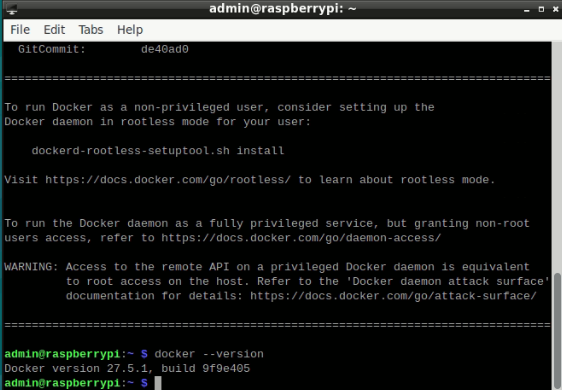

# Введение

DigitalPrint — это сервис для управления печатью, который позволяет легко настроить и управлять процессом печати через сервер, обеспечивая простоту использования и универсальность.

Вам будет передан каталог client для установки, параметр PRINTER_ID и адрес сервера. Эти данные будут использоваться для настройки вашего окружения.

Настройка включает в себя следующие этапы:

1. [Установку Docker и Docker Compose](#установка-docker-и-docker-compose)

2. [Настройку клиента и определение параметров принтера](#настройка-клиента)

# Терминал

Для выполнения установки, потребуется использовать встроенный терминал Raspberry Pi `LXTerminal`

Как открыть:


Выглядит он следующим образом:


Для вставки команд в терминал, используйте сочетание клавиш `ctrl + shift + c`, либо `правая клавиша мыши → Paste`

*Команды нужно выполнять поочередно, дожидаясь выполнения каждой предыдущей*

# Установка Docker и Docker Compose

Для начала необходимо установить Docker и Docker Compose на Raspberry Pi. Выполните следующие шаги:

## Шаг 1: Установка Docker

1. Выполните обновление системы:
    ```bash
    sudo apt-get update && sudo apt-get upgrade -y
    ```
2. Установите Docker:
    1. Скачайте установочный скрипт
        ```bash
        curl -fsSL https://get.docker.com -o get-docker.sh
        ```
    2. Запустите установочный скрипт
         ```bash
        sudo sh get-docker.sh
        ```
3. Проверьте успешную установку Docker
    ```bash
    docker --version
    ```
    Вы увидете в терминале:

    

    Если версия отобразилась — значит установка прошла успешно, можно переходить к следующему шагу

## Шаг 2: Установка Docker Compose

1. Установите необходимые зависимости:

    ```bash
    sudo apt install python3-pip python3-dev libffi-dev libssl-dev
    ```
2. Установите Docker Compose:

    ```bash
    sudo apt install docker-compose
    ```
    Если в терминале появится вопрос
    ```bash
    Do you want to continue? [Y/n] 
    ```
    Введите `y` и нажмите `Enter`
3. Проверьте успешную установку Docker Compose

    ```bash
    docker compose version
    ```
    Вы увидете в терминале

    

    Аналогично предыдущему, если версия отображается — можно переходить к следующему разделу

# Настройка клиента

В этом разделе вам нужно поработать с папкой clients: определить URI принтера, получить адрес хостинга и обновить файл .env, который находится внутри папки 

## Шаг 1: Определение URI и имени принтера
 
Для корректной работы хоста необходимо определить URI и имя вашего принтера

1. Остановите CUPS в системе
    ```bash
    sudo systemctl stop cups
    ```
    и
    ```bash
    sudo systemctl disable cups
    ```
2. Соберите контейнер:

    Тут понадобится ранее скачанная папка client. Поместив ее на рабочий стол, она будет доступна по пути `Desktop/client`
    1. Нужно перейти в папку `client` используя терминал
    ```bash
    cd Desktop/client
    ```
    В случае, если папка расположена по другому пути, используйте команды `cd` для перехода и `ls` для поиска

    Итак, после перехода в нужную директорию, потребуется собрать контейнер. Для этого, находясь внутри `client`, введите команду
    ```bash
    sudo docker compose up --build
    ```
    Дождитесь сборки контейнера. После сборки, вы будете видеть много ошибок
3. Зайдите внутрь контейнера. Для этого, откройте новый терминал и напишите в нем команду:
    ```bash
    sudo docker exec -it print_client bash
    ```
    *Дальнейшие команды выполняются внутри контейнера*
4. Получение имени и URI принтера

    Для начала, введите команду:
    ```bash
    avahi-browse -art
    ```
    Далее, можно увидеть строки, наподобие этих:
    ```bash
    =     lo IPv4 Kyocera ECOSYS P5026cdn (USB)                 Internet Printer     local
    hostname = [raspberrypi.local]
    address = [127.0.0.1]
    port = [60000]
    txt = ["air=none" "mopria-certified=2.0" "rp=ipp/print" ...]
    ```
    Исходя из этой информации, нужно собрать URI и имя принтера

    Для данного случая, URI имеет структуру:
    ```
    ipp://{address}:{port}/{rp}
    ```
    После замены, получаем:
    ```
    ipp://127.0.0.1:60000/ipp/print
    ```
    Имя принтера видно из вывода выше: `Kyocera ECOSYS P5026cdn`
    
    Но для дальнейшего использования, потребуется заменить пробелы на нижние подчеркивания
    
    Получаем `Kyocera_ECOSYS_P5026cdn`

Итак, после выполнения, мы имеем URI принтера и его имя. С этой информацией, переходим к следующему шагу

## Шаг 2: Редактирование .env

`.env` — ключевой файл для настройки системы client. По умолчанию является скрытым и может не отображаться. 

Для того, чтобы это исправить, нужно перейти во вкладку `View` и поставить галочку напротив `Show Hidden`:


Далее, откроем файл `.env`, он имеет такую структуру:

    ```env
    PRINTER_ID=1
    PRINTER_NAME=await
    PRINTER_URI=await
    PRINTER_PPD=everywhere
    SERVER_ADDRESS=https://digital-production-efdd.up.railway.app
    ```
В нем необходимо заменить:

`PRINTER_ID` — Уникальный идентификатор для каждой точки. Был передан ранее

`PRINTER_NAME` — был получен ранее. В нашем случае, будет иметь вид `Kyocera_ECOSYS_P5026cdn`

`PRINTER_URI` — был получен ранее. В нашем случае, будет иметь вид `ipp://127.0.0.1:60000/ipp/print`

`SERVER_ADDRESS` — был передан ранее

Итак, получаем файл со следующим содержимым:

    ```env
    PRINTER_ID=1
    PRINTER_NAME=Kyocera_ECOSYS_P5026cdn
    PRINTER_URI=ipp://127.0.0.1:60000/ipp/print
    PRINTER_PPD=everywhere
    SERVER_ADDRESS=https://digital-production-efdd.up.railway.app
    ```

После внесения изменений, необходимо сохранить файл (File → Save), после чего, можно закрыть

## Шаг 3: перезапуск контейнера

После редактирования `.env` файла, нужно перезапустить контейнер. Для этого, достаточно кликнуть внутри терминала, где он был запущен и нажать `ctrl + c`

После чего, командой `sudo docker compose up --build`, запустите контейнер повторно

На этом установка завершена, можно тестировать сервис через бота